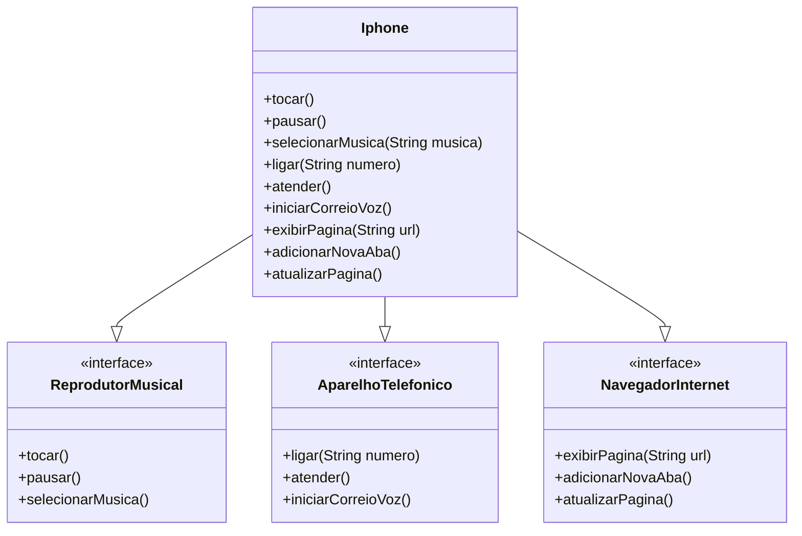

# Diagrama de Classes

```mermaid
classDiagram
Iphone --|> ReprodutorMusical
Iphone --|> AparelhoTelefonico
Iphone --|> NavegadorInternet

class Iphone {
    +tocar()
    +pausar()
    +selecionarMusica(String musica)
    +ligar(String numero)
    +atender()
    +iniciarCorreioVoz()
    +exibirPagina(String url)
    +adicionarNovaAba()
    +atualizarPagina()
}

class ReprodutorMusical {
    <<interface>>
    +tocar()
    +pausar()
    +selecionarMusica()
}

class AparelhoTelefonico {
    <<interface>>
    +ligar(String numero)
    +atender()
    +iniciarCorreioVoz()
}

class NavegadorInternet {
    <<interface>>
    +exibirPagina(String url)
    +adicionarNovaAba()
    +atualizarPagina()
}

```